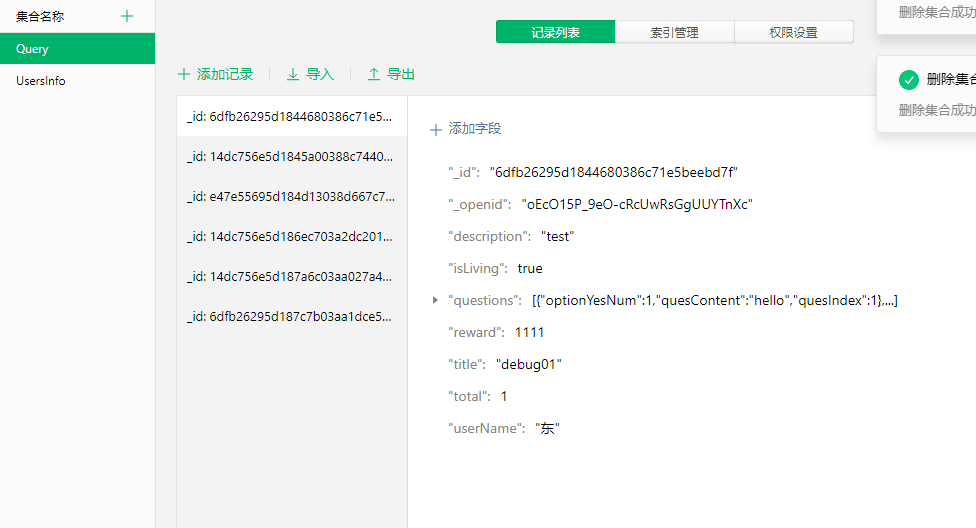
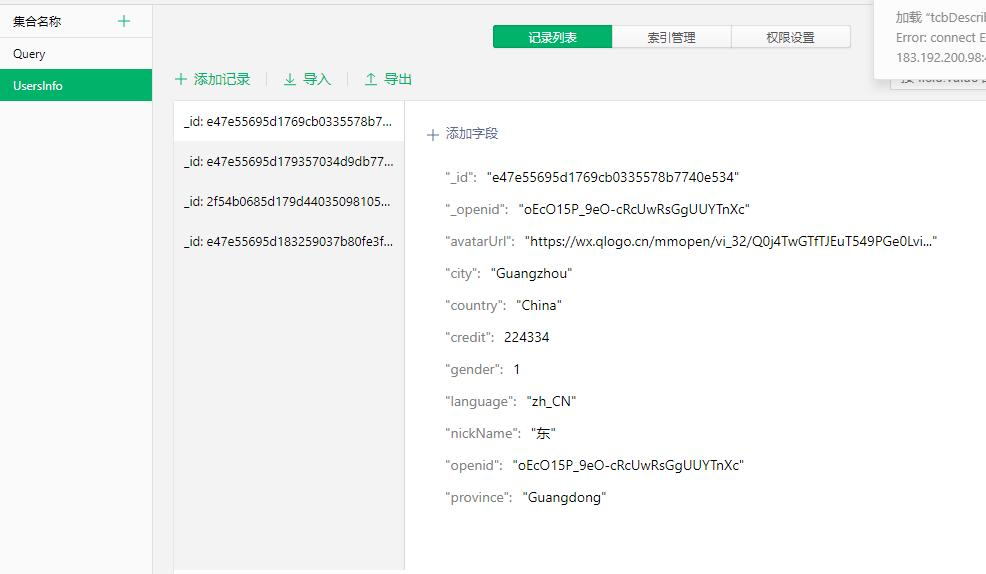
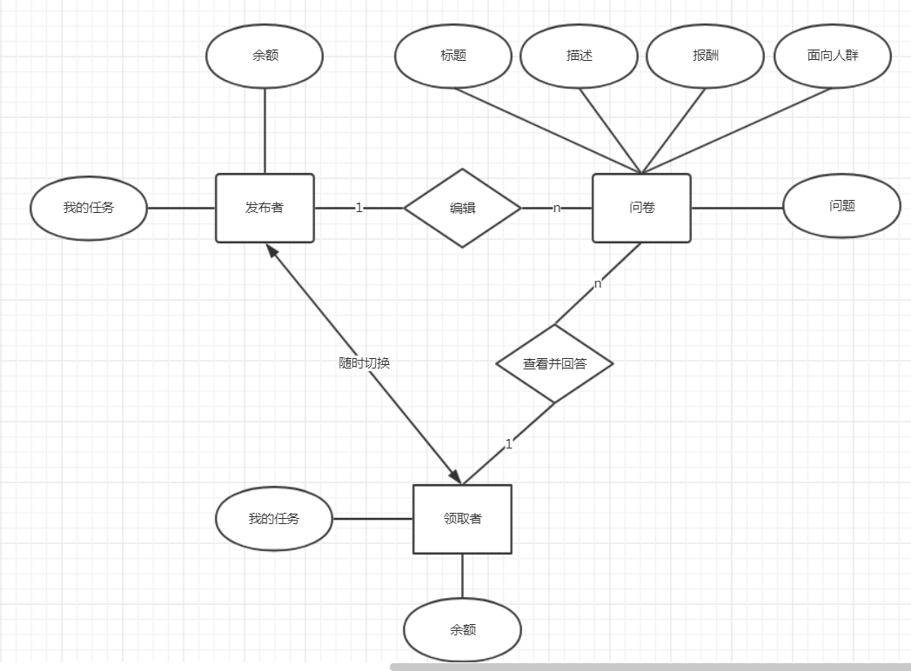

# Database Design
我们这次开发挣闲钱这个应用用的是微信小程序的云开发模型，使用的是云开发提供的云数据库，云开发提供了一个 JSON 数据库，顾名思义，数据库中的每条记录都是一个 JSON 格式的对象。一个数据库可以有多个集合（相当于关系型数据中的表），集合可看做一个 JSON 数组，数组中的每个对象就是一条记录，记录的格式是 JSON 对象。
关系型数据库和 JSON 数据库的概念对应关系如下表：

| 关系型 | 文档型 |
| --- | --- |
| 数据库database | 数据库database |
| 表table | 集合collection |
| 行row | 记录record/doc |
| 列column | 字段 field |

## 数据库实例
调查问卷

用户信息

每条记录都有一个 _id 字段用以唯一标志一条记录、一个 _openid 字段用以标志记录的创建者，即小程序的用户。需要特别注意的是，在管理端（控制台和云函数）中创建的不会有 _openid 字段，因为这是属于管理员创建的记录。开发者可以自定义 _id，但不可自定义和修改 _openid 。_openid 是在文档创建时由系统根据小程序用户默认创建的，开发者可使用其来标识和定位文档。

数据库 API 分为小程序端和服务端两部分，小程序端 API 拥有严格的调用权限控制，开发者可在小程序内直接调用 API 进行非敏感数据的操作。对于有更高安全要求的数据，可在云函数内通过服务端 API 进行操作。云函数的环境是与客户端完全隔离的，在云函数上可以私密且安全的操作数据库。

数据库 API 包含增删改查的能力，使用 API 操作数据库只需三步：获取数据库引用、构造查询/更新条件、发出请求。

## ER图

