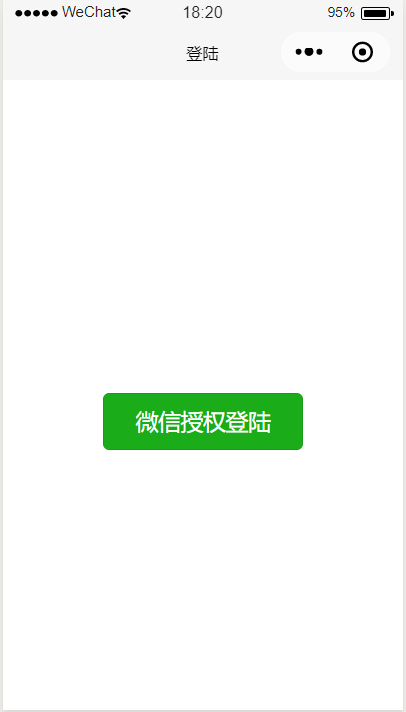
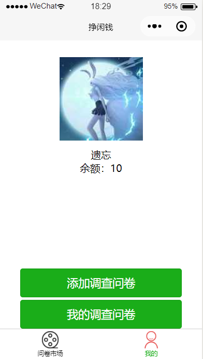
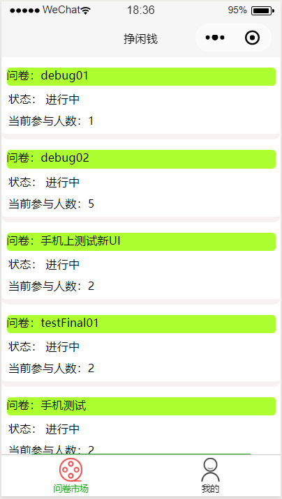
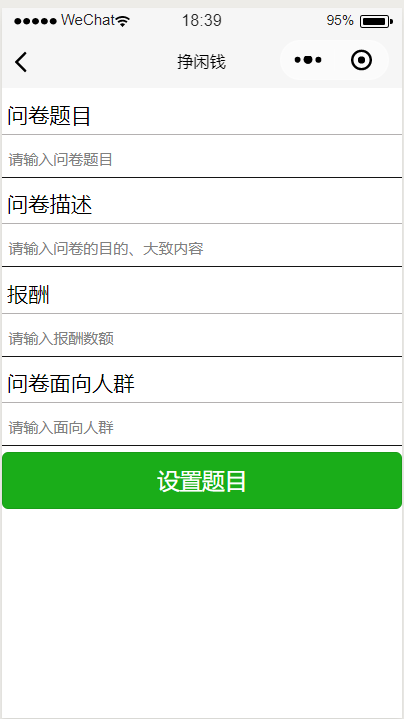
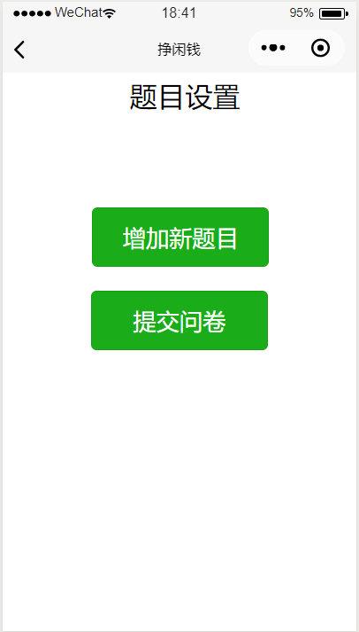
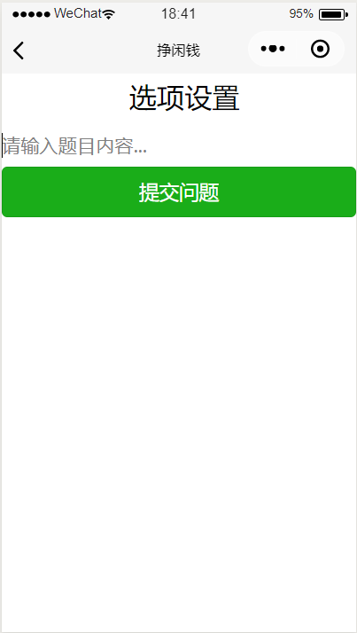
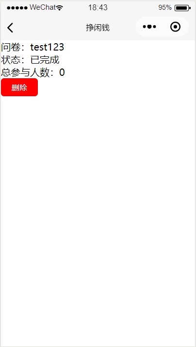
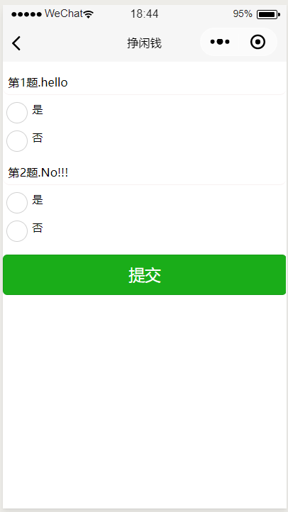

#UI Design
包括以下6个UI的设计

- 登录页面UI
- 用户页面UI
- 问卷市场页面UI
- 添加调查问卷页面UI
- 我的调查问卷页面UI
- 回答问卷页面UI
## 登录页面UI
登录使用微信授权登录

## 用户页面UI
用户界面包括头像、用户名、余额、添加问卷、我的问卷还有跳转问卷市场的功能

## 问卷市场页面UI
问卷市场有目前所有的问卷和问卷状态人数等，问卷市场也可以跳转回个人用户界面

## 添加调查问卷页面UI
添加调查问卷页面包含三种status，填写问卷、填写问题、和提交问卷

## 我的调查问卷页面UI
我的调查问卷包括我的所以问卷名，问卷状态和参与人数，同时可以结束删除问卷

## 回答问卷页面UI
回答问卷页面包括问卷题目和选项

